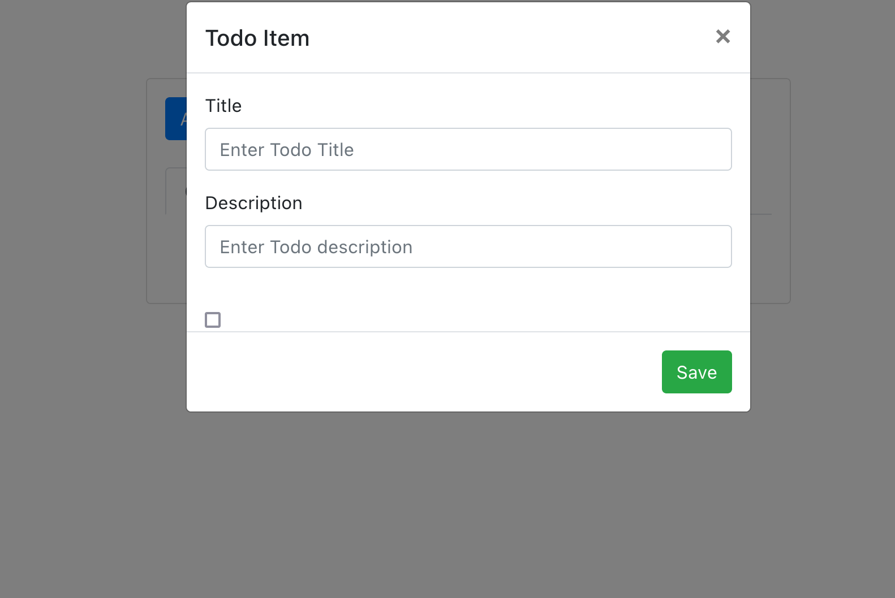

In this project will build a To-Do application using Django and React.

For this application, React serves as frontend, or client-side framework, handling the user interface and getting and setting the data via request to the Django backend, which is an APi build using Django Rest Framework(DRF).

# Project References

Article: https://www.digitalocean.com/community/tutorials/build-a-to-do-application-using-django-and-react

Manage project requirements: https://pypi.org/project/pipreqs/
